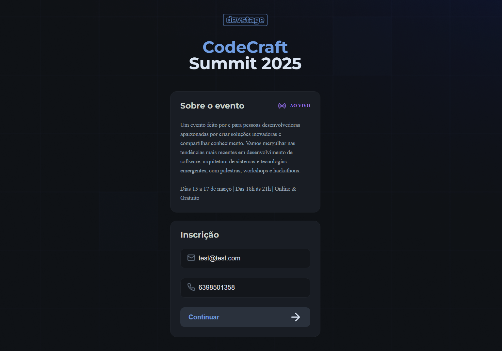
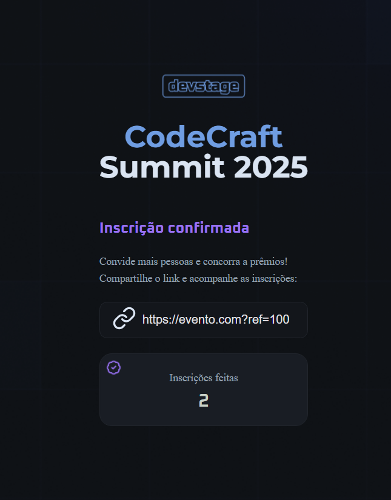

# DevStage
O CodeCraft é uma aplicação web para gerenciamento de inscrições em um evento. O sistema permite que os usuários se cadastrem e, após a inscrição, gerem um link exclusivo para convidar outras pessoas. Os participantes que mais indicarem novos inscritos concorrem a prêmios exclusivos!

# Captura de Tela

Página principal

Página do convite 

# Funcionalidades 

- Inscrição de Participantes: Os usuários preenchem um formulário com e-mail e telefone para se inscrever no evento.

- Geração de Link Personalizado: Após a inscrição, é gerado um link exclusivo para que o participante possa convidar outras pessoas.

- Sistema de Indicação: Cada inscrito pode acompanhar quantas pessoas ele convidou através do seu link.

- Ranking de Indicações: Os participantes que mais indicarem concorrem a prêmios especiais.

# Tecnologias Utilizadas

- HTML5: Estruturação das páginas.

- CSS3: Estilização e responsividade.

- JavaScript (ES6+): Manipulação do DOM, gerenciamento de inscrições e lógica de indicações.

# O que foi aprendido

- Manipulação de formulários e eventos no JavaScript.

- Uso da API URLSearchParams para capturar parâmetros na URL.

- Atualização dinâmica do DOM para exibir informações de inscrição.

- Geração e validação de dados dinâmicos (códigos de referência).